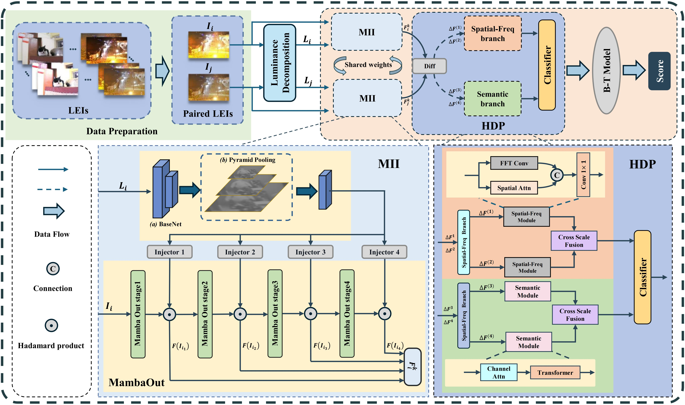

<h1 align="center">Low-light Image Enhancement Quality Assessment: A Real-World Dataset and An Objective Method </h1>

  

---

## 📌 Dataset Overview

RLIE is a real-world dataset for low-light image enhancement quality assessment, including:
- **10 enhancement algorithms**: LLFormer, GSAD, PairLIE, URetinex-Net, ZeroDCE, KinD, etc.
- **154 low-light scenes**: Selected from 15,787 candidates, covering extreme to moderate low-light conditions.
- **1,540 enhanced images**: 10 algorithms applied to each scene.
- **75 annotators**: Undergraduate students providing 103,950 annotations via 2AFC, converted to scores by Bradley - Terry model.

## 📌 Assessment Method Overview
MIIHDP (Multi-level Illumination Injection and Hierarchical Discrepancy Perception) is an objective assessment method for low-light enhanced images, including:
- **Illumination Decomposition**: Dual-branch UNet separates reflectance and illumination maps, with the latter ensuring spatial smoothness.
- **Multi-level Illumination Injection**: MambaOut extracts multi-scale features, with illumination components injected to enhance brightness sensitivity.
- **Hierarchical Discrepancy Perception**:
  - **Semantic Branch**: Analyzes deep features via channel differences and Transformer for scene structure.
  - **Spatial-Frequency Branch**: Suppresses high-frequency noise via 2D Fourier transform and enhances edges with spatial attention.
- **Score Generation**: Bradley-Terry model converts pairwise preferences to global scores via MLE.

## 📌 Training and Testing Viewpoints Selection

  

The dataset can be downloaded at the following links:
- Google Drive: [https://drive.google.com/file/d/1NOmNhuHE6SkOpIfC-539vzuaKxVQsWw1/view?usp=sharing](https://drive.google.com/file/d/1NOmNhuHE6SkOpIfC-539vzuaKxVQsWw1/view?usp=sharing)
- BaiDu Disk: [https://pan.baidu.com/s/1FUQtz_zvn7Oo4t5slTYs7g?pwd=prsv](https://pan.baidu.com/s/1FUQtz_zvn7Oo4t5slTYs7g?pwd=prsv) pwd: prsv
